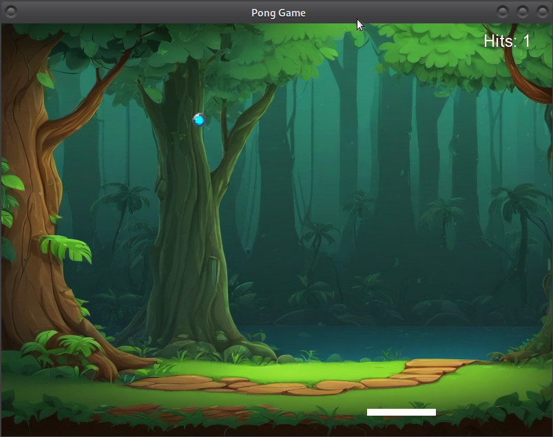

# Pong Game Documentation



## Introduction
This project is an educational example demonstrating the use of the SFML (Simple and Fast Multimedia Library) for creating a simple Pong game. The purpose of this project is to showcase the capabilities of SFML in handling graphics, audio, and user interactions.

## Requirements
To compile and run the game on a Linux system, you need to install the SFML library. You can do this using the following command:

```bash
sudo apt install libsfml-dev
```

## Building the Project
A script named `kompiluj.sh` is included in the project. This script automates the compilation process using the g++ compiler with the necessary SFML flags. To compile the project, navigate to the directory containing `kompiluj.sh` and run:

```bash
sh kompiluj.sh
```

## Running the Game
Once compiled, the game executable can be run from the terminal or by double-clicking the executable file in the `bin` directory. Make sure the necessary asset files (images, sounds, and fonts) are in the correct directories as specified in the code.

## Conclusion
This project serves as a basic example of using SFML for game development in C++. It demonstrates fundamental concepts such as handling graphics, audio playback, and user input. Feel free to explore and modify the code to enhance your understanding of SFML and game development.
